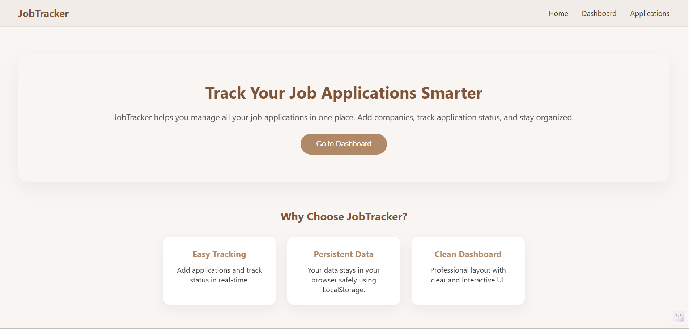
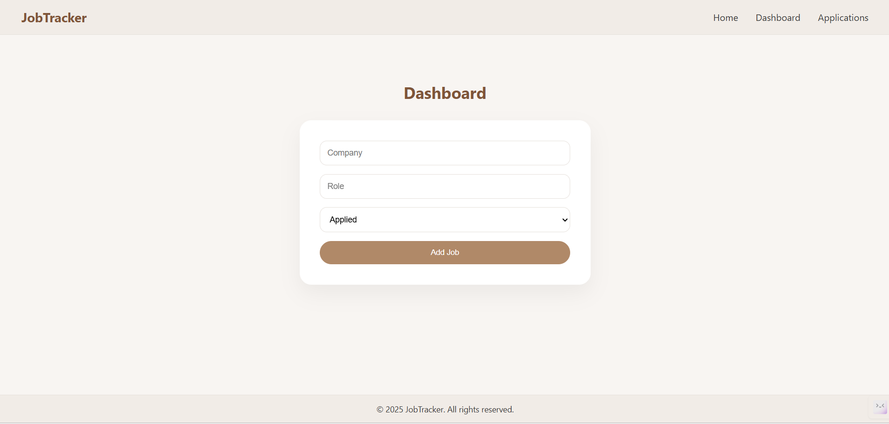
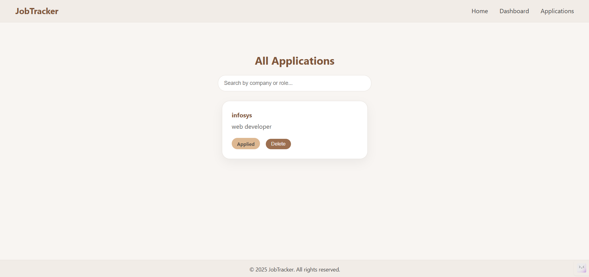

# Job Application Tracker

A modern and responsive **Job Application Tracker** built with **React, HTML, CSS, and JavaScript**.  
This project helps users to **add, track, and manage job applications** efficiently. It includes a **Home page, Dashboard, and Applications page** with clean UI, animations, and search functionality.

## 🌟 Features

- **Home Page**
  - Attractive hero section with **intro text and CTA button**
  - Features section describing the website functionality
  - Animated "How It Works" steps
  - Fully responsive design

- **Dashboard**
  - Add new job applications
  - Form validation for Company and Role
  - Stylish **success message** on adding application
  - Clean, professional design with animations

- **Applications Page**
  - View all added job applications
  - **Search bar** to filter applications by company or role
  - **Applied status** badge with color coding
  - **Delete button** with confirmation
  - Hover animations on job cards
  - Fully responsive layout

- **LocalStorage Integration**
  - Applications are saved in localStorage
  - Data persists across page reloads

- **Responsive & Modern Design**
  - Nude color palette
  - Rounded buttons and cards
  - Smooth animations on hover and page elements

---

## 🛠 Tech Stack

- **Frontend:** React, HTML5, CSS3, JavaScript  
- **Routing:** React Router DOM  
- **State Management:** React `useState` + `useEffect` for localStorage  

---

## 📂 Project Structure

JobApplicationTracker/
├── public/
│ └── index.html
├── src/
│ ├── components/
│ │ ├── Navbar.jsx
│ │ ├── Navbar.css
│ │ ├── JobForm.jsx
│ │ └── JobCard.jsx
│ │ ├── Footer.jsx
│ │ ├── Footer.css
│ ├── pages/
│ │ ├── Home.jsx
│ │ ├── Dashboard.jsx
│ │ └── Applications.jsx
│ ├── App.jsx
│ ├── index.js
│ └── index.css
│ └── main.jsx
└── package.json

## 🚀 How to Run

1. Clone the repository:

git clone https://github.com/kashish-0508/job-application-tracker.git
Navigate to the project folder:

cd applicationtracker
Install dependencies:

npm install
Start the development server:

npm start
Open your browser and go to:

http://localhost:3000

## 🎨 Design & UX
Clean and minimal nude color palette

Smooth animations on forms, buttons, and cards

Mobile responsive layouts

Professional UI suitable for portfolio and resume showcase

## 📌 Notes
Dashboard page is used only for adding applications

Applications page displays all added jobs with search and delete functionality

Data persists in browser localStorage

## 💻 Screenshots
**Home Page**  
  

**Dashboard Page**  
  

**Applications Page**  
  

⚡ Author
Kashish Bhardwaj

📄 License
This project is open source and free to use.

